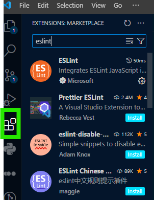

# SE-Assignment-5
Installation and Navigation of Visual Studio Code (VS Code)
 Instructions:
Answer the following questions based on your understanding of the installation and navigation of Visual Studio Code (VS Code). Provide detailed explanations and examples where appropriate.

 Questions:

1. Installation of VS Code:
   - Describe the steps to download and install Visual Studio Code on Windows 11 operating system. Include any prerequisites that might be needed.

   Here are the steps to download and install Visual Studio Code (VS Code):
   -Go to the Visual Studio Code download page(website).
   -Download the Installer: Click on the download button for Windows. This will start the download of the installer executable file.
   -Run the Installer: Locate the downloaded file (usually in your Downloads folder). Double-click the installer to run it.
   -Follow On-Screen Instructions: The installer will guide you through the installation process. Choose your preferred installation options (such as installation location). Accept the license terms and privacy statement.
   -Finish Installation: VS Code will be installed under C:\Users\{Username}   \AppData\Local\Programs\Microsoft VS Code by default.

   Alternatively, you can download a Zip archive, extract it, and run VS Code from  there.

2. First-time Setup:
   - After installing VS Code, what initial configurations and settings should be adjusted for an optimal coding environment? Mention any important settings or extensions.
   These are the configurations and settings I installed and adjusted in Visual Studio Code (VS Code) for an optimal coding environment:

Extensions:
I installed various extensions based on the languages we are learning in powerlearn project:
Python: “Python”, “Pylance”, mplstyle, python debugger
JavaScript/TypeScript: “ESLint”, “Debugger for Chrome”
HTML/CSS: “HTML CSS Support”
Git: “GitLens”

Settings:
Some important settings to consider:
Editor: Adjust font size, line height, and word wrap.
Files: Configure auto-save behavior.
Workbench: Customize UI colors, icons, and layout.
Extensions: Configure extension-specific settings.
Keybindings: Customize keyboard shortcuts.
Terminal: Set your preferred shell.
Git: Configure Git-related settings.
Theme and Color Scheme: Choose a theme that suits your preference (e.g., “Dark+ (default dark)” or “Light+ (default light)”).
Version Control (Git): Initialize Git in your project folder (git init). Install the “GitLens” extension for enhanced Git features. Configure your Git user name and email.
Integrated Terminal:
Use the integrated terminal for running commands.
Customize the terminal shell (e.g., PowerShell, Command Prompt, or Bash).
Code Formatting:
Set up code formatting rules (e.g., using Prettier or ESLint).
Configure VS Code to format code on save.
Keyboard Shortcuts: Learn and use keyboard shortcuts to improve productivity Access them via the gear icon > “Keyboard Shortcuts.”

3. User Interface Overview:
   - Explain the main components of the VS Code user interface. Identify and describe the purpose of the Activity Bar, Side Bar, Editor Group, and Status Bar.
  1. Activity Bar:
Located on the side (usually the left), it provides quick access to different functionalities:
Explorer: Navigating files and folders in your project.
Search: Searching across files.
Source Control: Managing Git repositories.
Run and Debug: Running and debugging your code.
Extensions: Managing VS Code extensions.
   2. Side Bar:
Adjacent to the Activity Bar, the Side Bar contains panels:
Explorer: Displays your project’s file structure.
Search: Allows you to search for text across files.
Source Control: Shows Git-related information.
Extensions: Lists installed extensions.
Outline: Provides an overview of symbols in the current file.
Debug: Helps with debugging tasks.
   3. Editor Group:
The central area where you open and edit files.
You can split it into multiple columns (editor groups) for side-by-side editing.
Each editor group can have one or more tabs representing open files.
   4. Status Bar:
Located at the bottom, it displays useful information:
Line and Column Numbers: Shows your cursor position.
File Encoding: Indicates the file encoding (e.g., UTF-8).
Language Mode: Displays the language mode (e.g., Python, JavaScript).
Git Branch: Shows the active Git branch.
Errors and Warnings: Alerts you to issues in your code.
Extensions: Provides quick access to extension-related actions.

4. Command Palette:
   - What is the Command Palette in VS Code, and how can it be accessed? Provide examples of common tasks that can be performed using the Command Palette.
   The Command Palette in Visual Studio Code is a powerful tool that allows you to access various features, commands, settings, and extensions directly via keyboard shortcuts or a menu. To open it:

Press Ctrl+Shift+P for Windows/Linux
Alternatively, click View > Command Palette from the application menu.

common tasks you can perform using the Command Palette:
   1. Run Tasks:
Type “Run Task” to execute predefined build or test tasks.
Example: Run a Python script or compile TypeScript.
   2. Change Themes:
Search for “Color Theme” to switch between different editor themes.
Example: Change to a dark theme like “Dark+ (default dark).”
   3. Install Extensions:
Type “Extensions: Install Extensions” to browse and install VS Code extensions.
Example: Install the “Python” extension for Python development.
   4. Format Code:
Use “Format Document” to automatically format your code.
Example: Format an HTML file or a JavaScript function.
   5. Toggle Features:
Search for specific features (e.g., “Toggle Word Wrap” or “Toggle Line Numbers”).
Example: Toggle word wrap for better readability.

5. Extensions in VS Code:
   - Discuss the role of extensions in VS Code. How can users find, install, and manage extensions? Provide examples of essential extensions for web development.
   Visual Studio Code (VS Code) extensions allows you to add languages, debuggers, and tools to your installation, making it more powerful and tailored to your needs. 

   How you can find, install, and manage extensions:
   -Finding Extensions:
Open VS Code and click on the Extensions icon in the Activity Bar 
Search for extensions by name or functionality (e.g., “JavaScript Snippets,” “CSS Peek,” etc.).
   -Installing Extensions:
Once you find an extension, click the Install button.
After installation, the button changes to a Manage gear icon.
   -Managing Extensions:
Use the Manage gear icon to configure extension settings or uninstall them.

Essential extensions for web development:
   JavaScript (ES6) Code Snippets:
Provides code snippets for JavaScript, TypeScript, Vue, React, and HTML.
No more repetitive code—boost your productivity.
   CSS Peek:
Jump directly to CSS code using classes and IDs.
Enhances CSS editing efficiency. 
   Auto Close Tag:
Automatically adds closing tags for HTML and XML.
Say goodbye to manual tag typing.
   REST Client:
Test APIs and view responses directly in VS Code.
No need for external tools like Postman. 
   ESLint:
Linting utility for JavaScript—catch common errors while you code.

6. Integrated Terminal:
   - Describe how to open and use the integrated terminal in VS Code. What are the advantages of using the integrated terminal compared to an external terminal?
   Opening the Integrated Terminal:
To open the integrated terminal, use one of the following methods:
Press Ctrl+** for Windows/Linux.
Click View > Terminal from the menu.
Use the terminal icon in the Activity Bar (usually on the left).
Using the Integrated Terminal:
Once open, you can:
Run commands (e.g., npm install, git commit, etc.).
Navigate to your project directory using cd.
Execute build scripts, start servers, or run tests.
Interact with Git (e.g., git status, git pull, etc.).

   Advantages of the Integrated Terminal:
Seamless Integration: It’s right within VS Code, so you don’t need an external terminal window.
Context Awareness: The terminal opens in the project folder, so you’re always in the right context.
Split View: You can split the terminal alongside your code editor for side-by-side work.
Customization: Configure your preferred shell (e.g., PowerShell, Bash) and font settings.
Debugging: Run and debug your code without switching to an external terminal.

7. File and Folder Management:
   - Explain how to create, open, and manage files and folders in VS Code. How can users navigate between different files and directories efficiently?
   Here’s how you can create, open, and manage files and folders:
   Creating Files and Folders:
To create a new file or folder, use the following methods:
Click the New File or New Folder buttons in the Explorer view.
Right-click in the Explorer view and choose the respective option.
Use keyboard shortcuts (e.g., Ctrl+N for a new file, Ctrl+Shift+N for a new folder).
   Opening Files and Folders:
Open a folder by selecting File > Open Folder… and choosing a directory.
If you launch VS Code from a terminal, pass the folder path as an argument (e.g., code . opens the current folder).
   Managing Files and Folders:
In the Explorer view, you can:
Create, delete, and rename files and folders.
Move files and folders using drag and drop.
Organize your project structure efficiently.

8. Settings and Preferences:
   - Where can users find and customize settings in VS Code? Provide examples of how to change the theme, font size, and keybindings.
   Open Settings Editor:
Navigate to File > Preferences > Settings.
Alternatively, use the shortcut Ctrl+, (Windows/Linux) or Cmd+, (Mac).
Examples of Customization:
   Change Theme:
Search for “Color Theme” in the Settings editor.
Choose your preferred theme (e.g., “Dark+ (default dark)”).
   Adjust Font Size:
Search for “Font Size” in the Settings editor.
Modify the font size to your liking (e.g., 14px).
   Modify Keybindings:
Search for “Keybindings” in the Settings editor.
Customize keyboard shortcuts as needed.

9. Debugging in VS Code:
   - Outline the steps to set up and start debugging a simple program in VS Code. What are some key debugging features available in VS Code?
   Create a Sample Application:
First, create a sample Node.js application or any other language you’re working with. For Node.js, you can follow the “Hello World” example.
   Open the Run and Debug View:
Click the Run and Debug icon in the Activity Bar (or use the shortcut ⇧⌘D on Mac or Ctrl+Shift+D on Windows/Linux).
This view displays all information related to running and debugging.
   Configure Launch Settings (Optional):
While you can run your active file directly, it’s beneficial to create a launch configuration.
VS Code stores debugging configuration in a launch.json file (usually in a .vscode folder in your workspace).
To create a launch.json file, select “Create a launch.json file” in the Run start view.
Configure the environment, program path, and other settings in this file.
   Start Debugging:
Press F5 or click the green play button in the top bar.
VS Code will try to run your active file or use the launch configuration you set up.
It will pause at any breakpoints you’ve set.

   Debugging Features:
Breakpoints: Set breakpoints by clicking in the gutter next to your code. Execution will pause there.
Step Through Code: Use step over, step into, and step out to navigate through your code line by line.
Watch Variables: Inspect variables and expressions during runtime.
Console: Print debug information using the integrated console.
Conditional Breakpoints: Set conditions for breakpoints to trigger.
Exception Handling: Configure how exceptions are handled.

10. Using Source Control:
    - How can users integrate Git with VS Code for version control? Describe the process of initializing a repository, making commits, and pushing changes to GitHub.
    Install Git:
Ensure Git is installed on your machine (at least version 2.0.0).
If not installed, download it from the official Git website.
   Open a Project Folder:
Open VS Code and navigate to your project folder.
The Source Control icon in the Activity Bar (on the left) will show your repository status.
   Initialize a Repository:
If your project isn’t tracked by Git, initialize a new repository:
Click the Source Control icon.
Select “Initialize Repository.”
Choose your project folder.
   Stage and Commit Changes:
Make changes to your files.
In the Source Control view:
Review unstaged changes (CHANGES).
Stage changes by clicking “+” next to each file (STAGED CHANGES).
Add a commit message and press Ctrl+Enter (macOS: ⌘+Enter) to commit.
   Push to GitHub:
Create a GitHub repository (if not done already).
In VS Code:
Click the “…” menu in the Source Control view.
Choose “Push” to push your commits to GitHub.

 Submission Guidelines:
- Your answers should be well-structured, concise, and to the point.
- Provide screenshots or step-by-step instructions where applicable.
- Cite any references or sources you use in your answers.
- Submit your completed assignment by 1st July 

